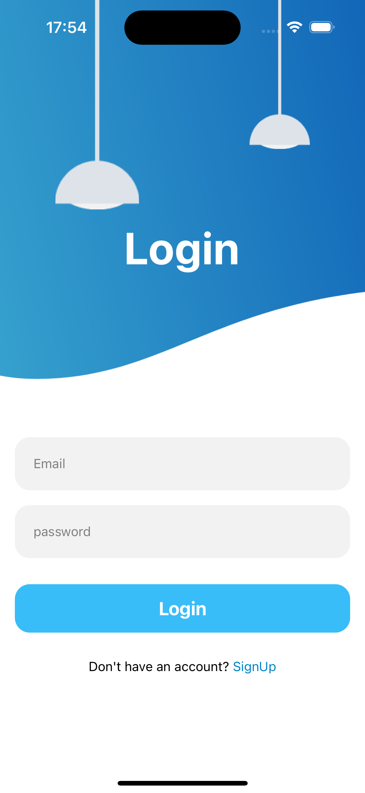
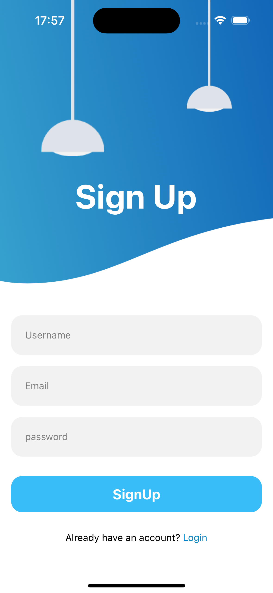

 # Reanimated Login/Logout Page

This project is a React Native application that features a reanimated login/logout page. It was developed using the following technologies:

- **Expo CLI**: A set of tools to create and manage React Native projects with minimal setup.
- **NativeWind**: A utility-first CSS framework for React Native, inspired by Tailwind CSS.
- **React Navigation**: A library for navigating between screens in a React Native app.

## Features

- Smooth animations using React Native Reanimated.
- Styled with NativeWind for responsive and modern UI design.
- Navigation between login and logout screens using React Navigation.

## Demo Video

<video width="640" height="360" controls>
  <source src="./Assets/images/demo.MP4" type="video/mp4">
  
</video>

# Project Screens

## Login Screen

## Logout Screen

